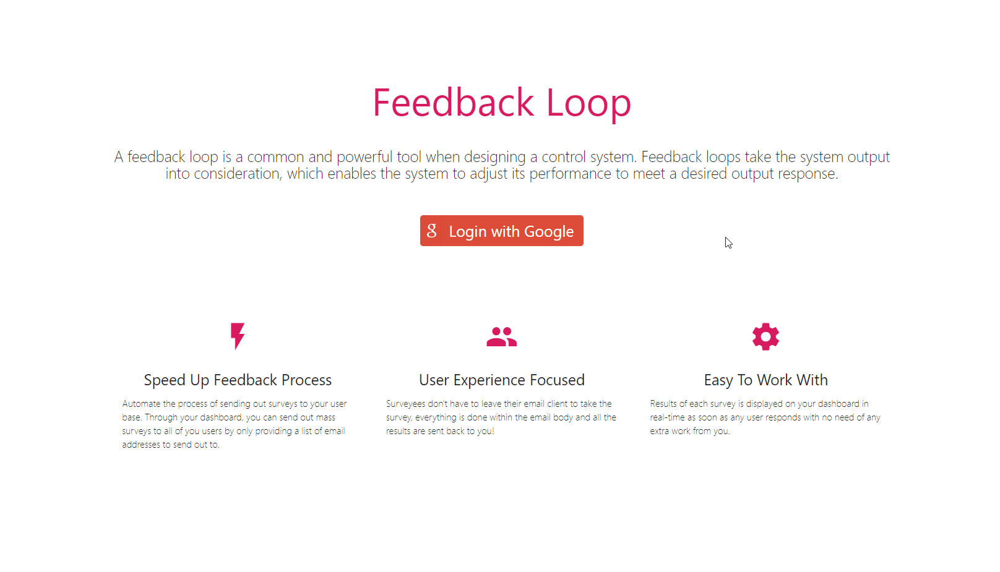

# Feedback Loop: Surveys Made Easier

> A [feedback](https://en.wikipedia.org/wiki/Feedback) loop is a common and powerful tool when designing a control system. Feedback loops take the system output into consideration, which enables the system to adjust its performance to meet a desired output response.
>

That's what **Feedback Loop** is aiming to achieve. By Facilitating the process of getting feedback from your users, you can use all of this precious feedback data and improve your products.

This web app automate the process of sending out surveys to your user base. Through your dashboard, you can send out mass surveys to all of you users by only providing a list of email addresses to send out to. This app handles the rest and the results of each survey is displayed in your dashboard in real-time as soon as any user responds.

To make things easier for your users, everything happens inside their email client, they are not redirected to any external pages, they just vote from within the body of the email address and the results are recorded on the backend of the application.

---

## Usage

To use the application, you need to buy credits first. Each mass survey - regardless of the number of emails sent - costs 1 US dollar. You can top up your credit count by buying credits which are sold in packs of 5 for 4.99$ each.

*Please note that payment is handled by a third-party service to ensure the security of the transaction.*

### Sending a survey

1. Sign in using your google account
2. Buy a pack of 5 credits to start sending out surveys
3. Click on the floating create button in the the bottom right corner of your dashboard
4. Fill out the survey name, email subject, email body, and list of email addresses to send the survey out to
5. Sit back and watch you dashboard for real-time updated on the results of each survey

---

## Get The App

### Live version

You can use the live deployed version on Heroku through this link.

### Build From Source

Make sure you have [Node.js](https://nodejs.org/) installed then follow the steps below:

1. Fork the repo or download the current branch as [zip](https://github.com/ahmedkrmn/Feedback-Loop/archive/master.zip)

2. `cd` into the project directory and run `npm install`

3. To test the Webhook locally, we'll be using [ngrok](https://dashboard.ngrok.com/get-started). Create an account and follow the steps provided to download the application executable. Place the downloaded file in the root directory of the Feedback Loop app.

4. You also need to have an account for each of [MongoDB Atlas](https://www.mongodb.com/cloud/atlas
  ), [Google Developer](https://console.developers.google.com/), [Stripe](https://stripe.com/) ,and [SendGrid](https://sendgrid.com/).

  *Note that you can also use a local copy of MongoDB instead of Atlas.*

5. Create a new file  `dev.js` in the `config/` directory and add in all the API keys required. You can check the `prod.js` file in the same directory for a list of all the keys you need.
6. Open up two terminal instances and run `npm run dev` and `npm run webhook`. You can't use concurrently with ngrok, so you that's why you have to have two separate terminals for each command.

#### Technical details

Here's the list of the major libraries and frameworks used:

|                                         Tool                                          |           Use            |
| :-----------------------------------------------------------------------------------: | :----------------------: |
|        [Express](https://www.express.com/) and [Node.js](https://nodejs.org/)         |   Backend Development    |
|                                        Stripe                                         | Online payment processor |
|                                [EJS](https://ejs.co/)                                 |     Templating HTLM      |
|                                       SendGrid                                        |  Email Delivery Service  |
| [Materialize](https://materializecss.com/) and [Bootstrap](https://getbootstrap.com/) |      CSS Frameworks      |
|                          [Mongoose](https://mongoosejs.com/)                          |       MongoDB ODM        |
|                       [Passport.js](http://www.passportjs.org/)                       |      Authentication      |

---

## What's next

1. Improving styling and the overall front-end.
2. Adding more surveying options. Currently the app only supports sending out surveys with "Yes" / "No" answers.
3. Enhancing the dashboard by adding charts and helpful analytics.
